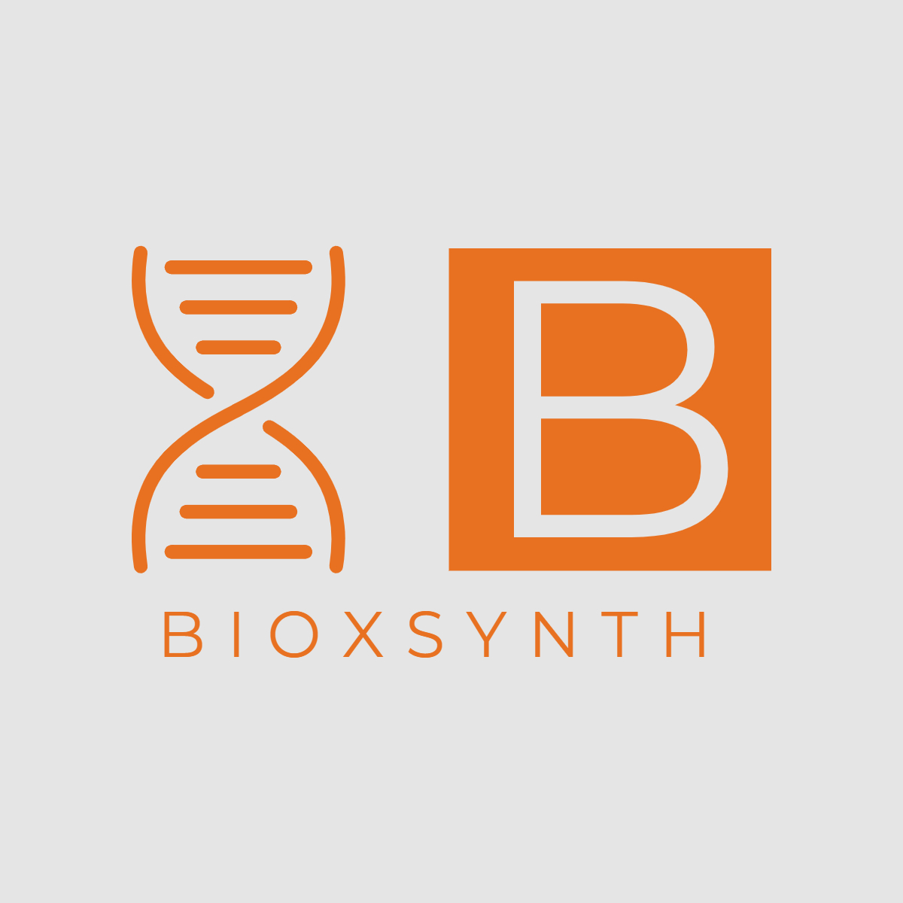

# Team - BioXsynth

An integrated framework for molecular bioreachability prediction. This is a structured solution for the Synthetic Biology Challenge of [ai4science hackathon](https://ai4science.io/), organized by [DeepVerse](deepverse.tech/en/), [Bota Bio](www.bota.bio), [Chemical.AI](https://chemical.ai/) and [Foreseen Biotechnology](www.foreseepharma.com/en-us).

## Project Highlights

The assessment of whether a given molecule can be made purely by biosynthesis is vital in starting a specific synthesis project, but it can be complicated and there is hardly any established model for this task. We designed a classification model which can classify a given molecule into two categories, bio-reachable and not bio-reachable, based on a two-step scoring system: (1) a molecular fingerprint similarity measure, and (2) a retrosynthetic-based accessibility score [RAscore](https://github.com/reymond-group/RAscore). We illustrated the explorative classification results of our model on the [MetaNetX](https://github.com/Chemino/ai4science-synth-bio/blob/main/mnx_chem_bioreachable.csv) and [PubChem BioCyc](https://github.com/Chemino/ai4science-synth-bio/blob/main/mnx_chem_bioreachable_PubChemBioCyc.csv) dataset. 

## 项目亮点

评估一个给定的分子是否可以纯粹通过生物合成来制造，对开始一个具体的合成项目至关重要，但这个评估过程可能很复杂，而且几乎没有任何成熟的模型来完成这项任务。我们设计了一个分类模型，该模型可以将一个给定的分子分为两类，即生物可到达的和生物不可到达的，基于一个两步的评分系统：（1）分子指纹相似性测量，和（2）基于逆合成分析的可及性评分[RAscore](https://github.com/reymond-group/RAscore)。我们在[MetaNetX](https://github.com/Chemino/ai4science-synth-bio/blob/main/mnx_chem_bioreachable.csv)和[PubChem BioCyc](https://github.com/Chemino/ai4science-synth-bio/blob/main/mnx_chem_bioreachable_PubChemBioCyc.csv)数据集上展示了我们设计的模型的探索性分类结果。

## 生物可合成性模型打分结果

## 数据模式 - MetaNetX数据集清洗与预处理：

- `reac_prop.tsv`包含大量生化代谢反应，其中涉及的所有化合物**均可视为bioreachable**
- 但这个数据集并不全（由于论文遗漏或未发现），也即**未出现在此数据集中的化合物也有可能bioreachable**
- 可能可以找一些其他的比如酶促反应之类的数据
- `reac_prop.tsv`里每条反应中，每种化合物（代谢物）以[MNX_ID](https://www.metanetx.org/mnxdoc/mnxref.html#MNX_ID)形式表示（例如MNXM01@MNXD1），需求配合`chem_prop.tsv`文件将MNX_ID转化为[InChIKey](https://en.wikipedia.org/wiki/International_Chemical_Identifier)作为每一个化合物的identifier
- 对于MNXM01@MNXD1这个例子，@字符之前的MNXM01是某种化合物的ID，而@字符之后的是其所处的 [generic compartment](https://en.wikipedia.org/wiki/Cellular_compartment)（比如不同的细胞器等等），这个部分对于我们这个项目并不重要，可以忽略，只考虑@之前的MNXM01即可
- InChIKey可以进一步通过[RDKit](https://www.rdkit.org/)转化为任意化学信息学表示，例如SMILES等
- 数据案例可以在`mnx_data_structure.ipynb`中直观看到

## 参考工作：

[RAscore](https://github.com/reymond-group/RAscore) - Retrosynthetic Accessibility score

> ## 赛题：给定的分子可以被生物合成吗？
> ### 背景:
> 分子的生物合成是通过利用生物体内的代谢途径来实现的。这些途径通常会分解起始分子（例如 D-葡萄糖）并重新排列原子以制造所需的最终分子（例如乙醇或姜黄素）。通常，这些代谢途径涉及多个步骤和多种酶催化剂。
> 
> 在 Bota，我们通过生物合成生产一些分子。有时我们的项目需要化学整理步骤（像是在化工厂中）。所以确定一个分子是否可以纯粹通过代谢途径（生物合成）或需要涉及化学整理步骤是启动项目的关键之一。
> 
> 这个评估有可能很复杂，因为有时酶催化剂是由人类使用定向进化得来的，这样扩大野生型生物学的范围。例如，混杂的酶可以进化为进行新的反应（例如，如果一种酶天然地使一种底物脱羧，它也可能进化为使类似的底物脱羧）。因此，仅生物化学所能达到的范围是模糊的，并不总是 100% 被定义。所以我们寻求算法来帮助人类做出判断。
> ### 目标:
> 这个黑客马拉松的目的是决定一个给定的分子是否可以通过生物合成从简单的底物（如 D-葡萄糖）或者是从已知可生物法得到的分子。您可以使用任何数据集来训练模型，以确定分子是否是生物可到达的（可通过代谢途径产生），而无需任何化学反应完成步骤。
> ### 数据集（推荐）:
> [MetaNetX](https://www.metanetx.org/mnxdoc/mnxref.html#MNX_ID) - 涵盖**所有代谢模型中分子并且具有产生他们的反应**，都可以被认为是生物可到达的，因为它们是细胞天然代谢的一部分。指定分子时请使用 InchiKeys 作为输入，因为这是不依赖于任意人类命名约定的最佳表示。也许可以提取这些分子的特征，将分类器构建成 Bio-reachable 或需要在实验室中进行化学处理？如果成功（对训练数据进行交叉验证时的有效模型），这将允许将该模型扩展到整个 Bio-reachable 空间。数据库 MetaNetX 肯定是不完整的（它没有所有生物可到达的分子 - 一些论文被遗漏了，新的发现等待着生物化学家！）。 **MetaNetX 还拥有数千个生物可到达的分子，它们还没有指定的反应来得到它们。** 关于这些分子中有多少是生物合成的，人类的知识存在空白。因此，仅细胞中的生物化学所能达到的范围是模糊的，而且并不总是 100% 确定的。我们寻求算法来帮助人类做出判断，从那些已知+注释为当今生物可到达（具有产生反应）的分子中学习。
> 
> [PubChem](https://pubchem.ncbi.nlm.nih.gov/) - 美国国立卫生研究院 (NIH) 的一个开放化学数据库，已成为科学家、学生和公众的重要化学信息资源。 PubChem 包含有关化学结构、标识符、化学和物理特性、生物活性、专利、健康、安全、毒性数据等的分子信息。因此，您可以通过 [PUG REST](https://pubchemdocs.ncbi.nlm.nih.gov/pug-rest)（一种用于访问上述分子信息的 REST API）扩展您的功能并丰富数据集。
> ### 参考：
> 一个很好的参考是 [Pathway design using de novo steps through uncharted biochemical spaces - PMC (nih.gov)](https://www.ncbi.nlm.nih.gov/pmc/articles/PMC5766603/)。在本文中，已知的酶促反应以及“广义反应规则”被无缝混合以计算目标分子的路径。然而，该方法不是开源的，而且它依赖于复杂的优化方法。我们相信一种更简单、更通用的机器学习方法可能是有用的。 此参考仅供参考。在这里，我们不寻找目标分子的路线，只是基于新的 AI/ML 方法对它们是否在生物学上可以达到的最佳猜测。如果模型可以帮助解释为什么分子是生物可到达的（模型中的什么特征) 将会是一个加分项。
